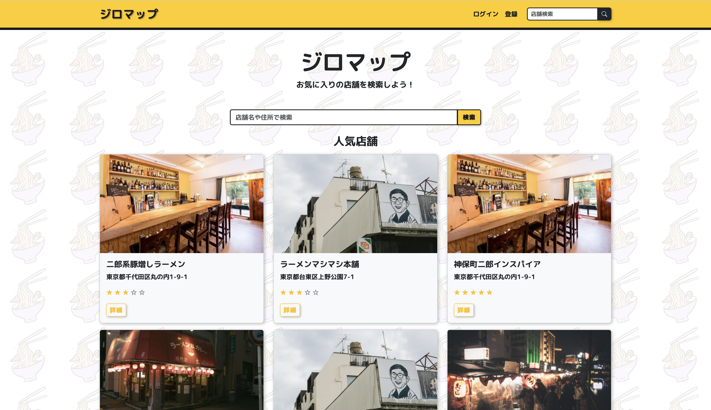
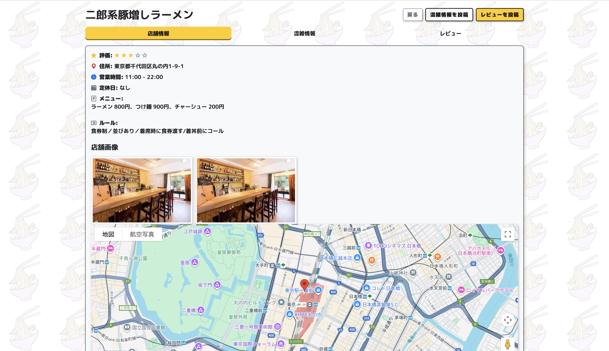
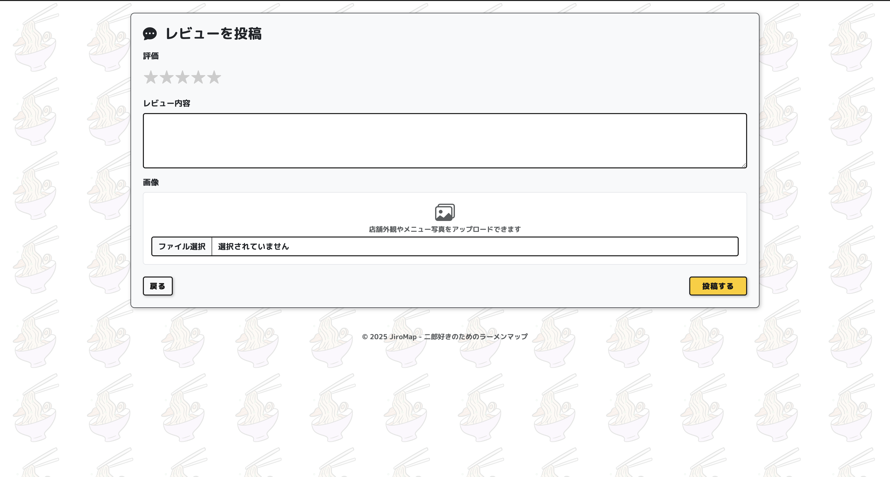
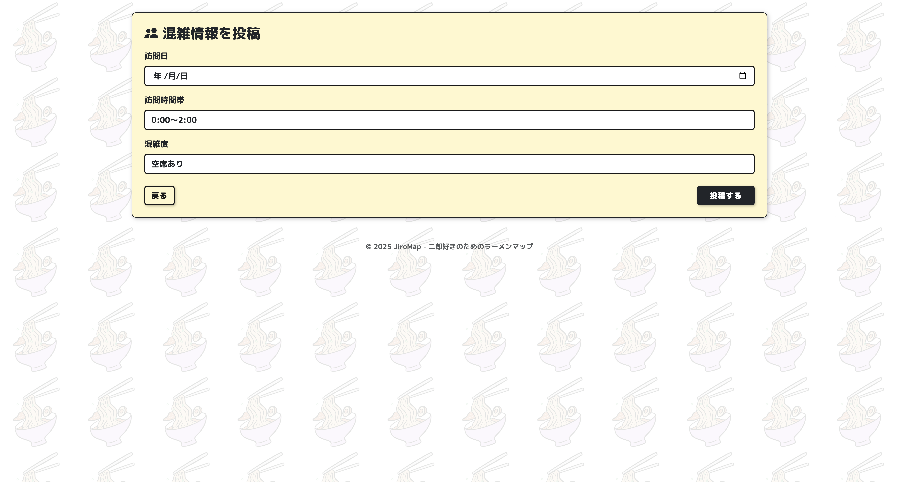
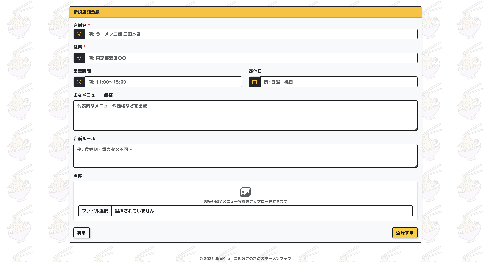
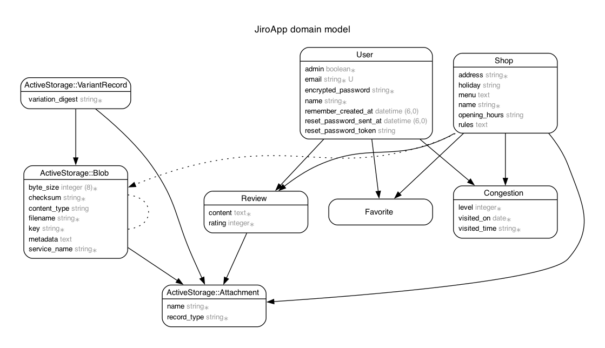

# ジロマップ🍜 



## アプリ概要
二郎系ラーメン店の「混雑状況」や「注文ルール」などを共有できるWebアプリです。  
初心者でも安心して来店できるように、混雑投稿や店舗のルール解説などを盛り込みました。

ユーザーは店舗情報の閲覧、レビュー投稿、混雑情報投稿、お気に入り登録が可能です。管理者は店舗の登録・編集・削除ができます。

---

## 本番URL
[https://jiro-map-app-e9d9b2f0a9b5.herokuapp.com](https://jiro-map-app-e9d9b2f0a9b5.herokuapp.com)

---

## 使用技術
- Ruby on Rails 7.1
- Ruby 3.3.4
- PostgreSQL
- Bootstrap 5
- Hotwire/Turbo（お気に入り登録の非同期処理）
- RSpec（テスト）
- RuboCop（コード整形）
- GitHub Actions（CI/CD）
- Google Maps API（店舗地図表示）
- Faker（ダミーデータ生成）
- Active Storage（画像アップロード）

---

## 機能
### ユーザー
- アカウント登録 / ログイン / ログアウト
- 店舗検索・閲覧


*店舗詳細画面。営業時間、ルール、レビュー、混雑情報が確認可能*

- レビュー投稿・編集・削除


*レビュー作成画面。画像添付も可能*

- 混雑情報投稿


*混雑度や曜日・時間帯を投稿可能*

- お気に入り登録

### 管理者
- 上記に加えて、店舗の登録・編集・削除


*管理者用画面。店舗管理が可能*

### ゲストログイン情報
**一般ゲストユーザー**
  - メール: `guest@example.com`
  - パスワード: `password`

**管理者ゲストユーザー**
  - メール: `guest_admin@example.com`
  - パスワード: `password`

> ※この情報を使うとログインせずにアプリを体験可能です。

---

## ER図


*ユーザー、店舗、レビュー、混雑情報、お気に入りの関係性を示すER図*

---

## 使い方

1. ユーザー登録・ログイン
2. 気になる店舗を一覧から探す
3. 詳細ページで混雑状況や注文方法をチェック
4. 自分でも混雑状況・レビューを投稿
5. マイページで履歴を確認・編集

---

## 工夫した点

- ユーザーの使いやすさを意識し、情報設計とUIをシンプルに保ちました
- 店舗詳細にGoogle Map埋め込み機能をつけ、地図からも探せるようにしました
- Deviseによる認証に加え、投稿内容のバリデーションと制限をしっかり設計しました
- N+1問題や不要なクエリを避けるため、includesやindex設計にも配慮しました
- お気に入り登録をTurboで非同期化し、UXを向上

---

## インストール方法

### 必要環境
- Ruby 3.3.x
- Rails 7.x
- PostgreSQL 15.x

### セットアップ
```bash
# リポジトリをクローン
git clone https://github.com/yujin2129/jiro-app.git
cd jiro-app

# 依存関係インストール
bundle install

# データベース作成・マイグレーション
rails db:create
rails db:migrate

# シードデータ投入
rails db:seed

# サーバ起動
rails server
```
